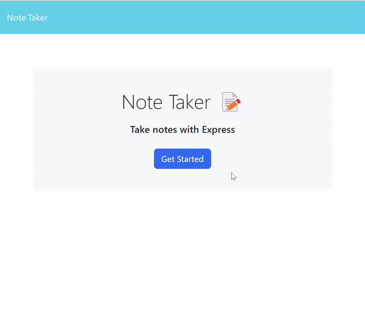

# 11 Express.js: Note Taker

## Description

This app allows users to quickly jot down notes and save them for later use. The app uses Express.js back end and retreives the users notes from a JSON file by using Express.js requests. The user can add and remove notes from the JSON file by interacting with the apps front end.

## Tasks 

- Linked the front end starter code with my own backend code.
- Used express.js to interact with assets in my public folder and display it on the main page.
- Created pathways in the server.js which switches the page or dynamically populates the page with json data.
- utilized POST, GET, and DELETE requests.

## Usage

## Links

GitHub Repo Page: https://github.com/rambriz91/quick-jot

## Credits
- https://nodejs.org/api/fs.html#fswritefilesyncfile-data-options
- https://stackoverflow.com/questions/17604866/difference-between-readfile-and-readfilesync#:~:text=For%20better%20understanding%20run%20the%20above%20code%20and%20compare%20the%20results..&text=readFileSync()%20is%20synchronous%20and,they%20function%20in%20the%20background.
- https://stackoverflow.com/questions/65015000/how-do-i-use-express-js-app-delete-to-remove-a-specific-object-from-an-array
## License

MIT License

Copyright (c) [2023] [Robert Ambriz]

Permission is hereby granted, free of charge, to any person obtaining a copy
of this software and associated documentation files (the "Software"), to deal
in the Software without restriction, including without limitation the rights
to use, copy, modify, merge, publish, distribute, sublicense, and/or sell
copies of the Software, and to permit persons to whom the Software is
furnished to do so, subject to the following conditions:

The above copyright notice and this permission notice shall be included in all
copies or substantial portions of the Software.

THE SOFTWARE IS PROVIDED "AS IS", WITHOUT WARRANTY OF ANY KIND, EXPRESS OR
IMPLIED, INCLUDING BUT NOT LIMITED TO THE WARRANTIES OF MERCHANTABILITY,
FITNESS FOR A PARTICULAR PURPOSE AND NONINFRINGEMENT. IN NO EVENT SHALL THE
AUTHORS OR COPYRIGHT HOLDERS BE LIABLE FOR ANY CLAIM, DAMAGES OR OTHER
LIABILITY, WHETHER IN AN ACTION OF CONTRACT, TORT OR OTHERWISE, ARISING FROM,
OUT OF OR IN CONNECTION WITH THE SOFTWARE OR THE USE OR OTHER DEALINGS IN THE
SOFTWARE.